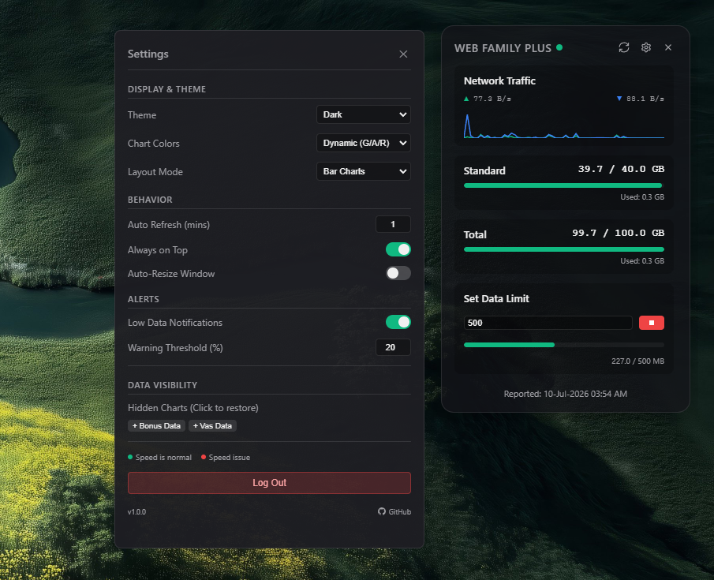
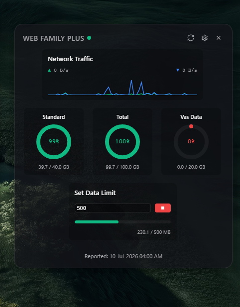
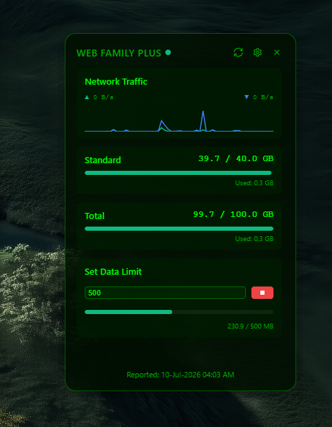
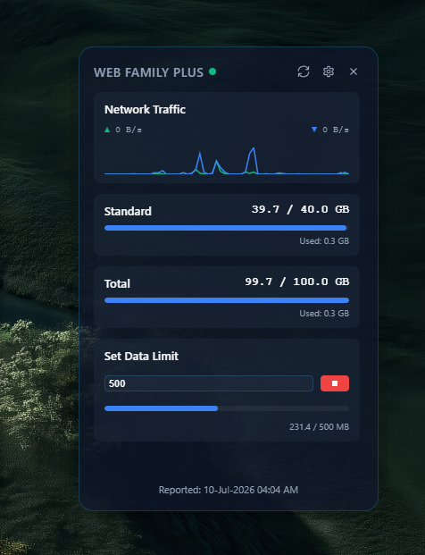
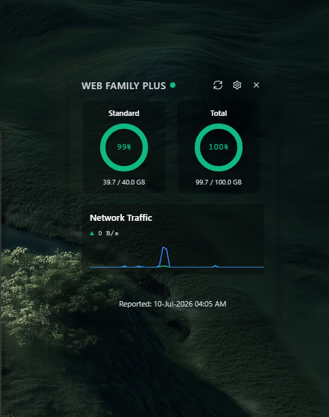
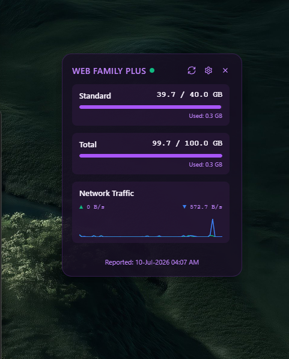
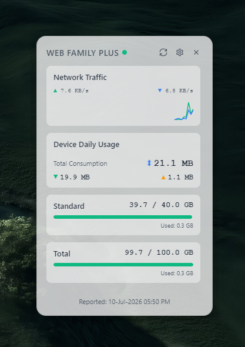
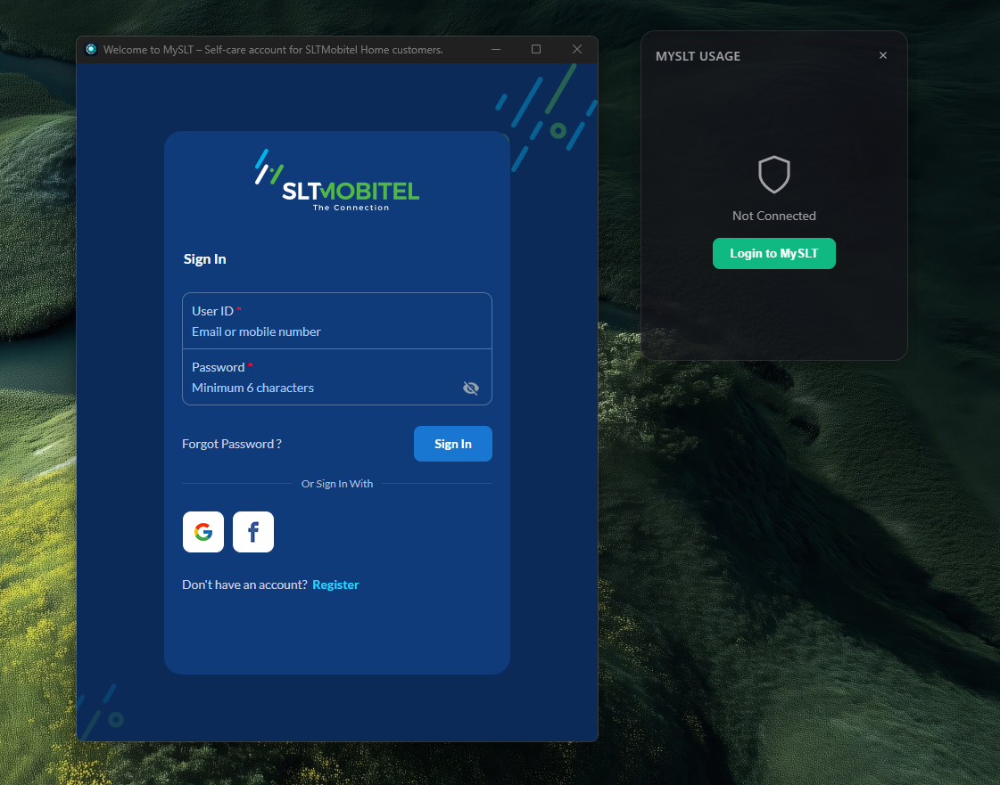

  
  <h1>SLTDU Widget</h1>
  
<b>A sleek, customizable SLT Data Usage Desktop Widget for Windows</b>

  Track your Sri Lanka Telecom (SLT) broadband data usage right from your desktop.

---

  

## ✨ Features
- **Real-Time Data Tracking**: Monitor standard, bonus, free, extra GB, and VAS data limits effortlessly.
- **Daily Device Tracking**: Keep tabs on your PC's exact daily internet consumption (Download, Upload, and Total) with a customizable, auto-resetting 24-hour tracker.
- **Network Speed Monitoring**: Keep a live eye on your active upload and download speeds, featuring a robust network interface engine that seamlessly supports Wi-Fi and ignores virtual adapters (VPNs, VMs, etc.).
- **Beautiful Glassmorphism UI**: A stunning, modern design that blends seamlessly with your Windows desktop.
- **Smart Alerts**: Receive system notifications when your data usage reaches low or critical thresholds.
- **System Tray Integration**: Minimized footprint. Runs quietly in the background and can auto-launch on startup.
- **Always On Top**: Keep your widget floating gracefully over other windows for quick glances.

---

## 🎨 Customize As You Want!

  

 

Make it yours! The widget is highly customizable. Pick from various layouts (Bar charts vs. Pie charts), chart color modes, and vibrant themes like Dark, Light, Midnight Blue, Midnight Purple, Hacker Terminal, or Transparent Glass.

  <table>
    <tr>
      <td></td>
      <td></td>
      <td></td>
    </tr>
    <tr>
      <td></td>
      <td></td>
      <td></td>
    </tr>
  </table>

---

## 🚀 Installation Guide

1. Go to the **Releases** tab on this repository.
2. Download the latest `SLTDU Widget Setup 1.1.0.exe` installer file.
3. Double-click the `.exe` file to start the installation.
4. Follow the on-screen instructions to install the app.
5. Once installed, launch the **SLTDU Widget** from your desktop shortcut or Windows Start menu!

---

## 🔌 How to Connect Your SLT Account

To fetch your real-time data, the widget needs to authenticate with your MySLT account. It does this securely by loading the official portal.

  

### Step-by-Step Guide:
1. When you open the widget for the first time (or when your session expires), an authentication window will automatically pop up.
2. The popup will securely load the official **MySLT Portal** (`https://myslt.slt.lk/`).
3. Log in using your standard MySLT credentials (mobile number/username and password/OTP).
4. As soon as you log in successfully, the widget will automatically intercept your secure authentication token and subscriber ID in the background.
5. The login window will close automatically, and your desktop widget will instantly come to life and start displaying your data!

*(Privacy Note: Your login credentials are NEVER stored by the widget. It only stores the temporary session token locally to fetch your data, and all network requests are sent directly to the official SLT servers.)*

---

## 🛠️ Technical Details
- Built with **Electron** for the desktop environment.
- Uses **Vanilla HTML/CSS/JS** for an ultra-fast, lightweight UI without bulky frameworks.
- Communicates directly with SLT's BBVAS APIs.

## 📄 License
This project is for educational and personal use.
